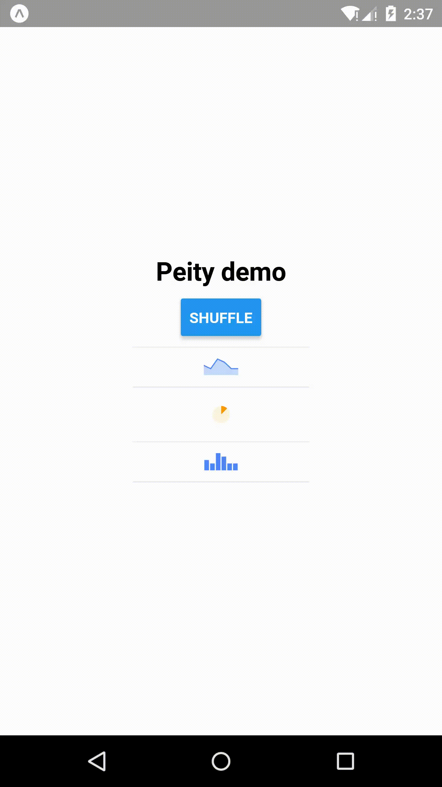

# react-native-peity

Port for [peity](https://github.com/benpickles/peity)

## Install from npm

> `react-native-peity`


## Basic usage

```jsx
import { Line } from 'react-native-peity'

<>
  <Line data={[1, 5, 4, 2, 2]} />
  <Pie data={6} min={0} max={10} />
  <Bar data={[1, 5, 4, 2, 2]} />
  <Pie data={6} min={0} max={10} innerRadius={3} /> {/* donut */}
</>
```



## Docs

More detailed usage can be found at benpickles.github.io/peity.
